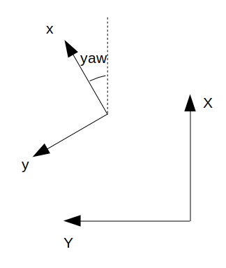

# ekf_python_experiment
Python implementation to understand EKF operation.

## Overview
In this repository, EKF is implemented on simple robot models.

The data flow is here.


## Setup
Clone the repository and submodule.
```bash
git clone https://github.com/RyosukeMatsushima/ekf_python_experiment.git --recursive
```

## 2D robot model
[ekf_2d](ekf_2d) is about EKF with 2d robot model like this figure.



The state estimated by EKF is position X, Y in inertial coordinate system and it's velocity and yaw.

IMU sensor data to predict the state are acceleration and angular velocity on robot coodinate.
Position data is needed to update state.
All input data includes sensor noise.

### Run
1. Run simulation.
```bash
python3 ekf_2d/simulate.py <simulate time[s]>
```
ex.
```bash
python3 ekf_2d/simulate.py 100
```

2. View result.
```bash
python3 ekf_2d/results_analyzer.py
```

## 3D robot model
TODO
